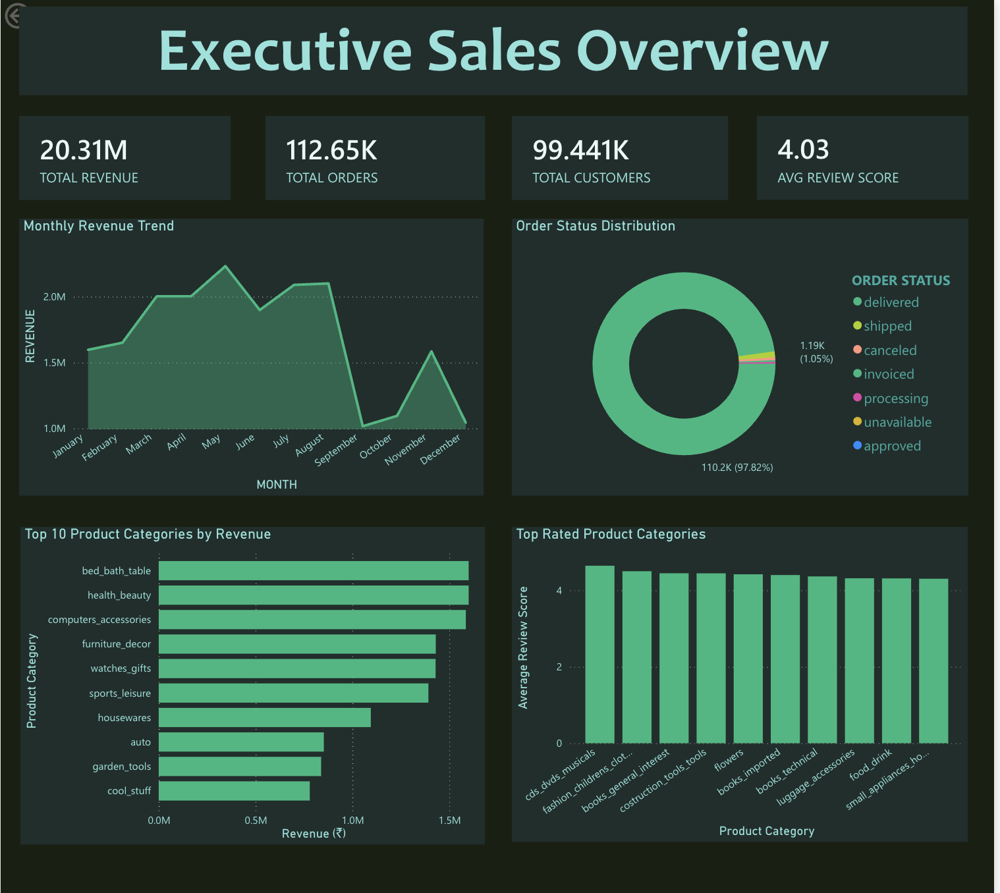
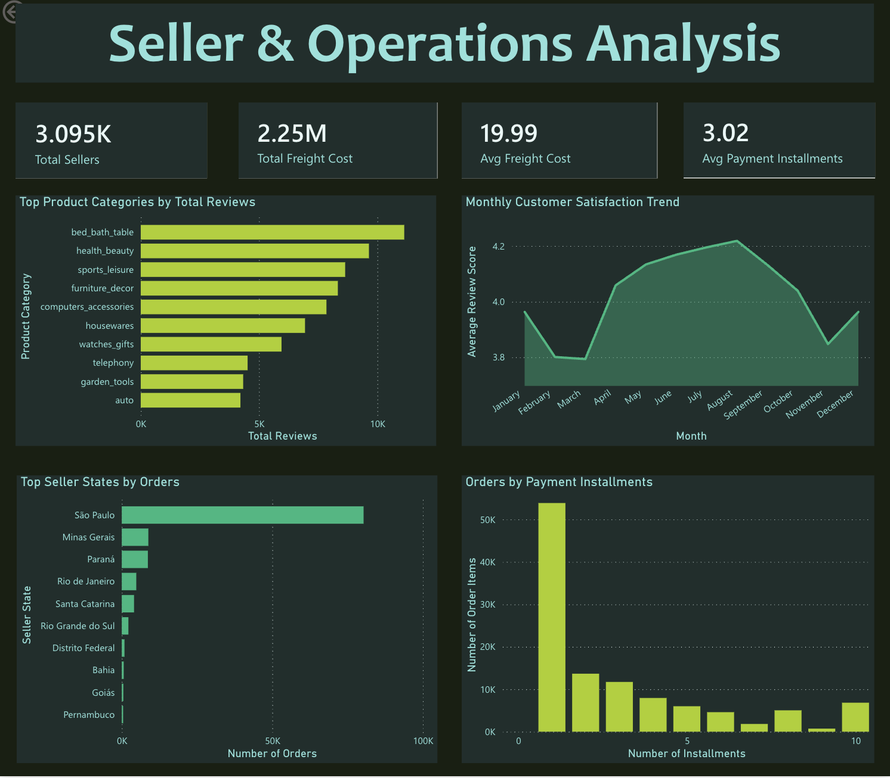

# 🛒 Olist E-Commerce Analytics Pipeline

An end-to-end modern data engineering project built using **dbt**, **Snowflake**, and **Power BI** to transform raw Brazilian e-commerce data into a production-ready analytics warehouse.

The project follows industry-standard data modeling practices including **Staging → Intermediate → Marts**, implements comprehensive data quality testing, documentation, source freshness monitoring, incremental models, and delivers business insights through interactive Power BI dashboards.

---

## 📌 Project Overview

The Olist dataset contains information about customers, sellers, products, orders, payments, reviews, and deliveries from a Brazilian e-commerce marketplace.

Raw transactional data alone is difficult for analysts to query efficiently. This project transforms raw operational tables into clean, documented, analytics-ready dimensional models following dbt best practices.

The final warehouse powers interactive dashboards for sales analysis, customer behavior, seller performance, logistics, product insights, and payment analytics.

---

## 🏗️ Architecture

```
                Raw CSV Files
                      │
                      ▼
                Snowflake RAW
                      │
          dbt Sources & Freshness
                      │
                      ▼
            Staging Layer (Views)
      Standardization & Cleaning
                      │
                      ▼
         Intermediate Layer (Views)
      Business Logic & Transformations
                      │
                      ▼
        Mart Layer (Fact & Dimensions)
        Analytics Ready Data Models
                      │
                      ▼
             Power BI Dashboard
```

---

## 🛠️ Tech Stack

| Technology | Purpose |
|------------|---------|
| Snowflake | Cloud Data Warehouse |
| dbt Core | Data Transformation |
| SQL | Data Modeling |
| Jinja | Reusable dbt Macros |
| YAML | Documentation & Testing |
| Power BI | Dashboard & Reporting |
| Git | Version Control |
| GitHub | Project Repository |

---

## 📂 Project Structure

```
Olist_Project/

├── models/
│   ├── staging/
│   ├── intermediate/
│   ├── marts/
│
├── macros/
│
├── tests/
│
├── seeds/
│
├── snapshots/
│
├── analyses/
│
├── dbt_project.yml
│
└── README.md
```

---

## ✨ Features

- Layered dbt architecture (Staging → Intermediate → Marts)
- Analytics-ready Star Schema
- Incremental Dimension Models
- Generic Tests
- Singular Business Rule Tests
- Source Freshness Monitoring
- Custom dbt Macros
- Seed Files
- Comprehensive Documentation
- Data Quality Validation
- Interactive Power BI Dashboards

---

## 📊 Data Models

### Staging
- Customers
- Orders
- Order Items
- Products
- Sellers
- Payments
- Reviews
- Category Translations

### Intermediate

- Customer Orders
- Order Details
- Payment Summary

### Mart

**Fact Table**

- Fact Orders

**Dimension Tables**

- Dim Customers
- Dim Products
- Dim Sellers

---

## 📖 Documentation

This repository includes detailed documentation for:

- Sources
- Staging Models
- Intermediate Models
- Mart Models
- Tests
- Macros
- Business Logic

---

## 📊 Interactive Analytics Dashboard

The transformed warehouse data is visualized in **Power BI** through two interactive dashboards that provide insights into sales performance, customer behavior, seller operations, logistics, and product performance.

---

## 📈 Dashboard 1 – Executive Sales Overview

This dashboard provides a high-level business overview of the e-commerce marketplace.

### Key Performance Indicators

- 💰 Total Revenue
- 📦 Total Orders
- 👥 Total Customers
- ⭐ Average Review Score

### Visualizations

- Monthly Revenue Trend
- Order Status Distribution
- Top 10 Product Categories by Revenue
- Top Rated Product Categories

### Business Insights

- Monitor monthly sales performance.
- Identify the highest revenue-generating product categories.
- Analyze customer satisfaction across different product categories.
- Track the distribution of order statuses to identify fulfillment bottlenecks.

### Dashboard Preview



---

## 🚚 Dashboard 2 – Seller & Operations Analysis

This dashboard focuses on seller performance, shipping costs, customer reviews, and payment behavior.

### Key Performance Indicators

- 🏪 Total Sellers
- 🚛 Total Freight Cost
- 📦 Average Freight Cost
- 💳 Average Payment Installments

### Visualizations

- Top Product Categories by Total Reviews
- Monthly Customer Satisfaction Trend
- Top Seller States by Orders
- Orders by Payment Installments

### Business Insights

- Identify regions with the highest seller activity.
- Analyze customer satisfaction trends throughout the year.
- Understand freight cost distribution across all orders.
- Examine customer payment behavior through installment analysis.
- Measure customer engagement by product category using review counts.

### Dashboard Preview



---

## 📌 Dashboard Features

- Interactive filtering and cross-highlighting
- Executive KPI cards
- Revenue trend analysis
- Product performance analysis
- Customer satisfaction tracking
- Seller performance monitoring
- Freight cost analysis
- Payment behavior insights
- Clean dark-themed dashboard design
